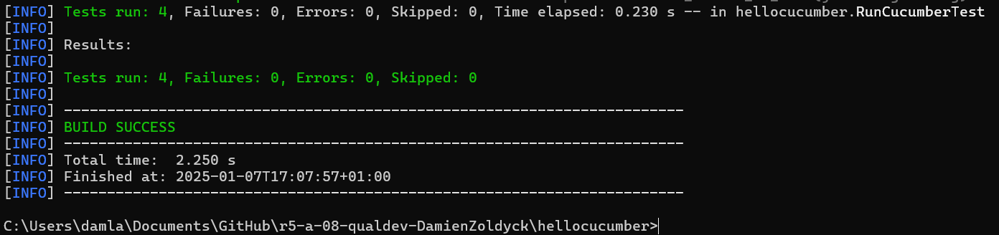
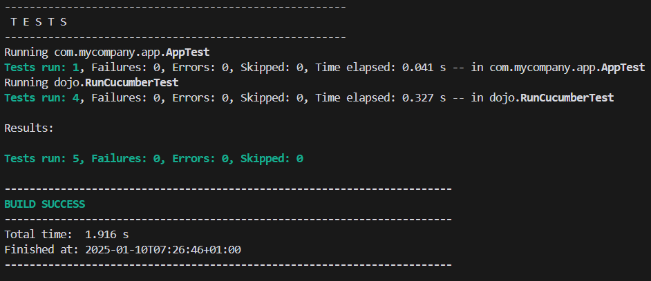

= R5.A.08 -- Dépôt pour les TPs
:icons: font
:MoSCoW: https://fr.wikipedia.org/wiki/M%C3%A9thode_MoSCoW[MoSCoW]

Ce dépôt concerne les rendus de mailto:damien.laboute@etu.univ-tlse2.fr[Damien Laboute].

== TP1

---
Feature: Is it Friday yet?
  I want to know if it's Friday today.
  Scenario Outline: Checking if today is Friday
    Given today is <day>
    When I ask if it's Friday
    Then I should be told "<answer>"
    Examples:
      | day            | answer |
      | Friday         | TGIF   |
      | Sunday         | Nope   |
      | anything else! | Nope   |
---

== TP2

---
package dojo;

public class Order {
    private String from;
    private String to;
    private String message = "";

    public Order(String from, String to) {
        this.from = from;
        this.to = to;
    }

    public String getTicketMessage() {
        if (message.isEmpty()) {
            return String.format("From %s to %s", from, to);
        }
        return String.format("From %s to %s: %s", from, to, message);
    }

    public void setMessage(String message) {
        this.message = message;
    }

    public String getTo() {
        return to;
    }
}
---

